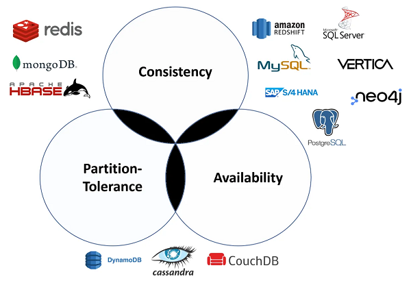
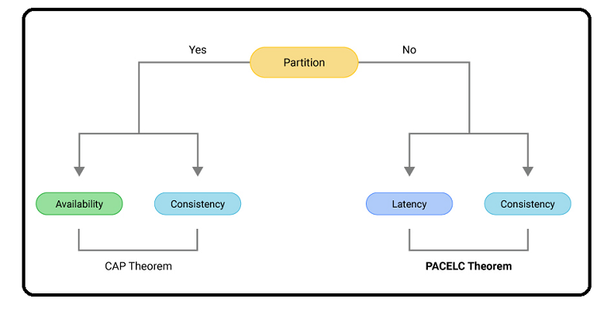

# CAP theorem

The CAP Theorem serves as a crucial framework for assessing distributed systems. It revolves around three fundamental principles:

1. **Consistency:** Same data across all the nodes. When a write occurs, subsequent reads retrieve either the most recent write or an error. For example, synchronous replication ensures consistency in a Master-Replica setup. However, asynchronous replication will lead to inconsistency if the Master confirms a write before receiving confirmation from Replicas; inconsistency might arise if the Replica's write fails.

2. **Availability:** Guaranteeing that every request gets a response, even if it might not contain the latest information. In leaderless replication, any node can fulfill write requests, ensuring read and write operations availability. Or reading stale reads in asynchronous replication.

3. **Partition Tolerance:** The system continues to operate despite arbitrary partitioning due to network failures.
In a distributed system, Nodes are connected via a network. Due to network failure, it will appear as if there is a partition in our system. For example, the system displays partition tolerance if communication breaks between nodes due to a network failure, yet users can still retrieve data.

The CAP Theorem states that in a distributed system, you can only support two of the above guarantees: your system can be CP, AP, or CA, but achieving all three (CAP) is impossible.

In practical terms, Partition Tolerance is essential and non-negotiable due to network unreliability in distributed systems. Thus, You'll need to make a software tradeoff between consistency and availability. Opting for consistency might render the system unavailable, whereas prioritizing availability can lead to data inconsistency.

- **CP (Consistency and Partition Tolerance):** Ideal for scenarios like banking transactions, ensuring atomic reads and writes. However, waiting for a response from a partitioned node could result in timeout errors.

- **AP (Availability and Partition Tolerance):** Suitable for cases like social media comments, where responses provide readily available data, possibly not the latest. Writes may take time to propagate, ensuring eventual consistency.

## Cons of CAP Theorem: 

1. Critiques of the CAP Theorem include its assumption of 100% availability or consistency, which doesn't align with real-world scenarios. Real systems often exhibit degrees of both consistency and availability. Like banking transactions, ATMs could allow balance inquiries and small withdrawals but block large withdrawals/deposits until the partition is resolved.

2. It doesn't account for scenarios where there are no network failures, i.e., the system is operating normally, which is most of the time.
To address this, the **PACELC theorem** extends CAP; It states that when the system is running normally in the absence of partitions, one has to choose between latency (L) and loss of consistency (C). 

There are two possible scenarios:

- **High consistency and high latency:** eg. synchronous replication: suppose we have a system of one Master and two replicas. So when the user sends a write request to master, it will propagate the changes to its replicas synchronously, and after receiving confirmation from replicas, it will send confirmation to the user.

- **Low consistency and low latency:** eg. asynchronous replication: In the same setup as above, if the Master immediately sends the confirmation to the user after writing the value locally, the changes will be propagated asynchronously.

